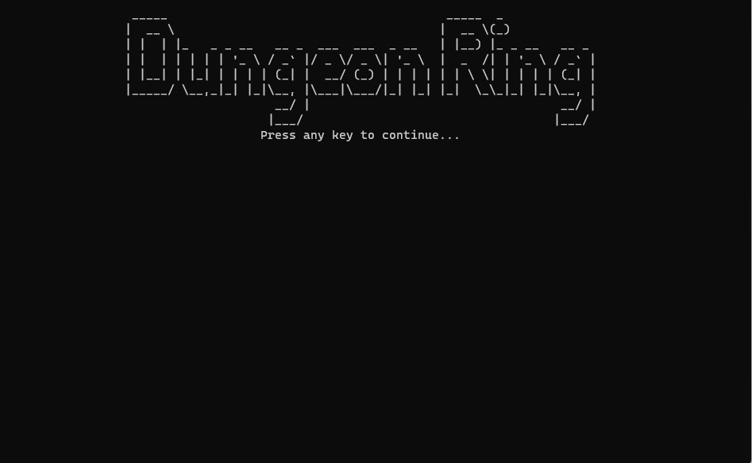
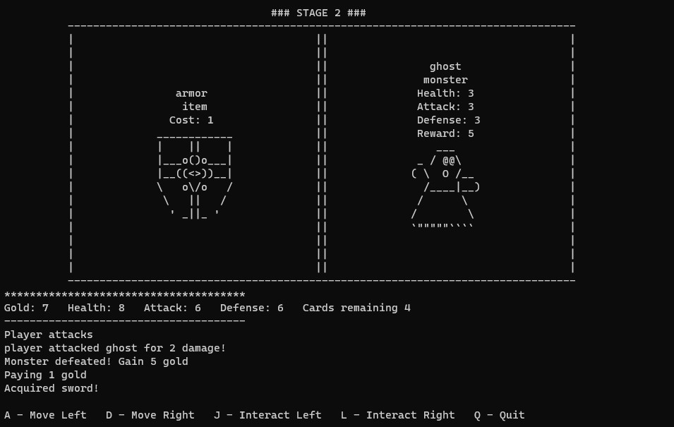
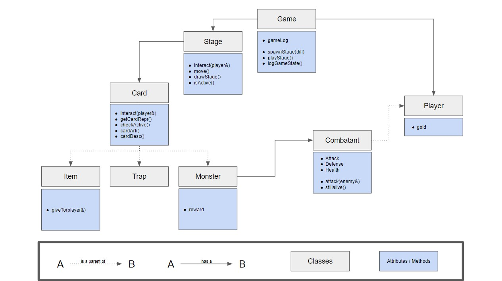

# Dungeon Ring

This is a little console dungeon crawler game I wrote in C++ as a toy project.

The game is simple - at each turn, the player has to choose between two cards (left or right). All the cards must be cleared from the board to advance to the next stage, and once all the stages are cleared, the game is over.

## Gameplay

There are different varieties of cards, such as monster cards, trap cards, and item cards, which each have unique effects on the player.
* Item cards contain boosts that can be purchased for gold.
* Trap cards inflict negative effects onto the player.
* Monster cards must be defeated by the player.

There are several other basic concepts which are pretty standard:
* Health - Monsters are defeated when their health falls to 0, and the game is over when the player's health falls to 0.
* Acttack & Defense - In combat between a player and a monster, health is only taken away (damage) if the attacker's attack is greater than the defender's defense.
* Gold - Used to purchase item cards. Gold is earned when the player defeats monsters.

## Code Structure

Of course, the game is written in an object-oriented manner, with only a handful of classes. The main classes and their most relevant attributes and methods are shown in the diagram below.

### `Game`

The `Game` class is the only class that is directly referenced in `main()`. 
* `spawnStage()`: Spawn a new stage when the game begins and whenever the player clears the previous stage.
* `playStage()`: Event loop that awaits input and does the appropriate actions according to that input.
* `logGameState()`: prints out the state of the game and player stats.
* `gameLog`: a deque that keeps track of the last few lines that are logged, so that it can be printed nicely below the graphics. This is required because the screen is cleared every time the player presses a key, and we want to retain the screen state for a more polished UI experience.

The `Stage` class, as it is named, represents a stage (level) of the game.
* `interact()` is used when the player wants to interact with a card (either the left or right). The `Stage` looks then triggers the `interact()` method for the correct card using its list of pointers.
* `move()` increments or decrements the position of the player, to determine which cards are adjacent to the player.
* `drawStage()` is the method behind the graphics (see screenshot above). It takes the `getCardRepr()` method of the cards adjacent to the player, and prints the cards on the screen.
* `isActive()` is the callback method that checks whether there are still cards remaining in the stage.

The `Card` class is the parent class for all cards in the game.
* `interact()` is called when the player interacts with a card. It invokes any effects on the player's stats directly (via reference).
* `checkActive()` is the callback method that checks whether the card should be destroyed or not.
* `getCardRepr()` returns a string representation of the card, so that it can be nicely printed on the screen graphics.
* `cardArt()` and `cardDesc()` are used to build the string representation in `getCardRepr()`.

`Item`, `Trap`, and `Monster` are all relatively simple subclasses of `Card`.
* `Item` has an additional method of `giveTo()`, which invokes the effect of the card onto the player stats. It is called via `interact()`.
* `Monster` has an instance of `Combatant`, and also has an attribute `reward`, which indicates the amount of gold the player gains from defeating the monster.
* `Trap` has no additional methods.

The `Combatant` abstract class represents all objects that can fight.
* As such, it has `health`, `defense`, and `attack` stats.
* It also has an `attack()` method, which allows it to attack an enemy `Combatant` (and do damage).
* There is a callback method `stillAlive()` which is used by the `Stage` class to determine the appropriate action.

The `Player` class is a simple subclass of `Combatant`.
* The only additional attribute is `gold` (and associated encapsulation methods), which allows us to keep track of the player's gold.
